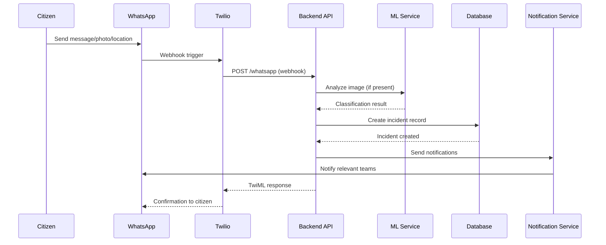
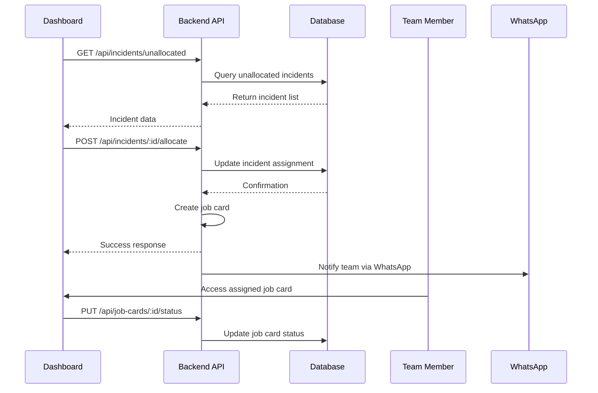
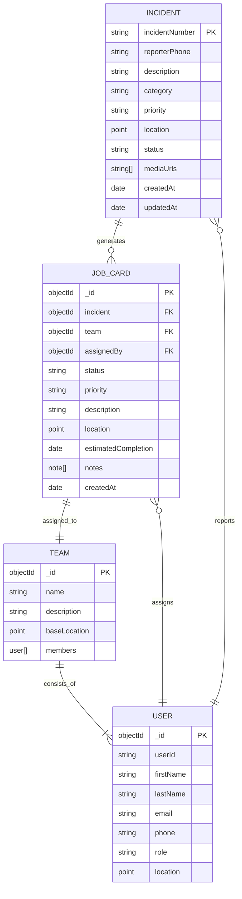
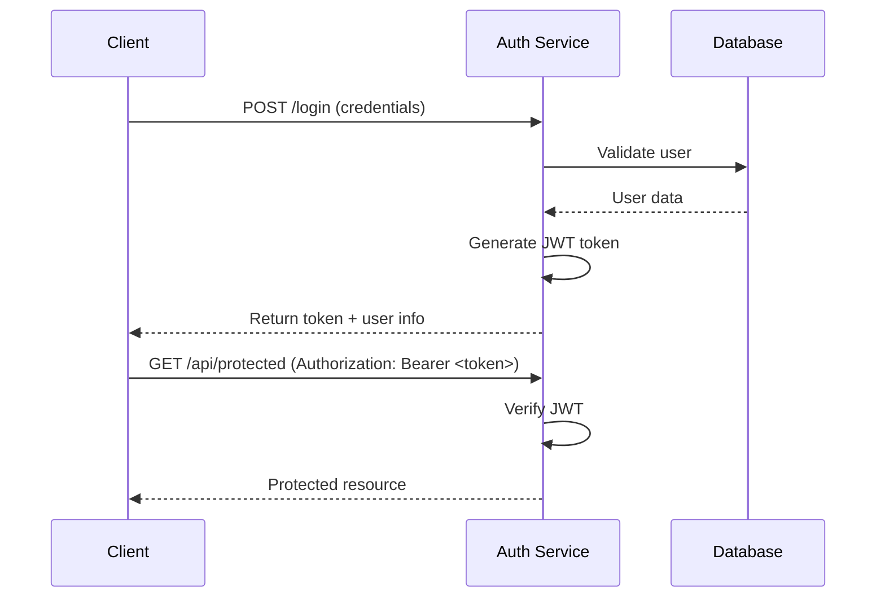
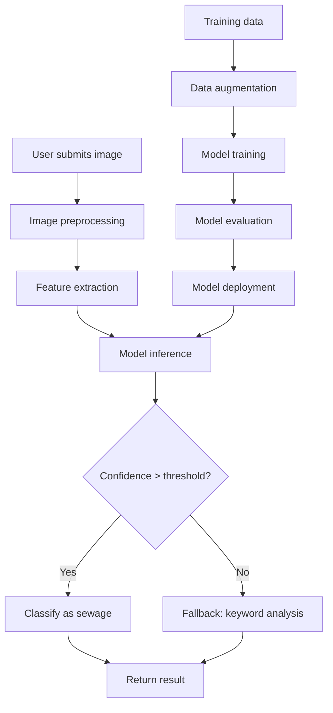
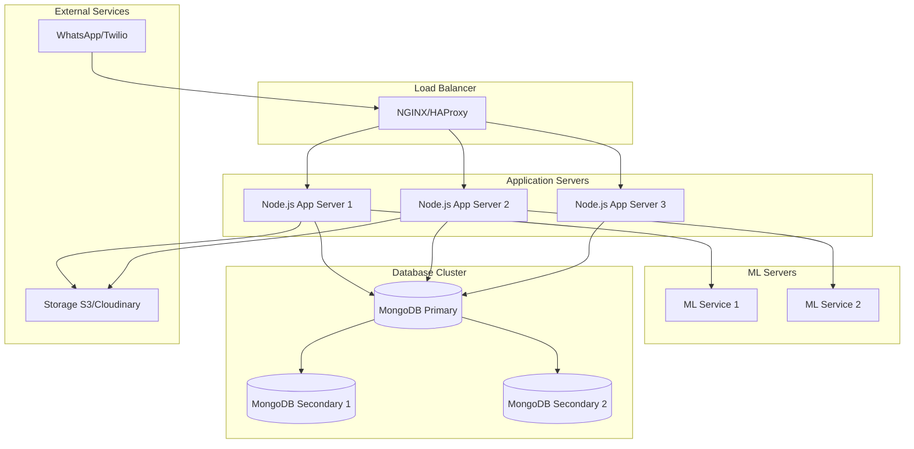
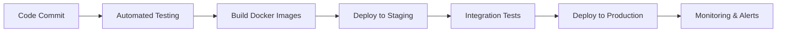

# Iqembu Lamanzi - System Architecture

## Overview

Iqembu Lamanzi is a comprehensive sewage incident management system that combines machine learning, real-time communication, and geospatial data management. The system enables citizens to report sewage issues via WhatsApp, automatically analyzes images using AI, and provides maintenance teams with efficient incident tracking and resolution tools.

## System Components

### 1. Backend Services (Node.js/Express)

**Location:** `/backend/`

**Responsibilities:**
- RESTful API for incident and job card management
- WhatsApp integration via Twilio
- User authentication and authorization
- Real-time notifications
- Geospatial data processing

**Key Technologies:**
- Node.js + Express.js
- MongoDB with Mongoose ODM
- JWT for authentication
- Twilio for WhatsApp integration
- Socket.io for real-time updates (planned)

### 2. Machine Learning Service (Python)

**Location:** `/backend/ml/`

**Responsibilities:**
- Image classification for sewage-related content
- Real-time analysis of user-submitted photos
- Model training and evaluation
- Fallback keyword-based analysis

**Key Technologies:**
- PyTorch/TensorFlow
- OpenCV for image processing
- NumPy, Pandas for data manipulation
- Flask/FastAPI for model serving (planned)

### 3. Frontend Dashboard (React/Vue)

**Location:** `/frontend/` (planned)

**Responsibilities:**
- Incident monitoring and management
- Team assignment and tracking
- Heatmap visualization
- Real-time status updates
- Mobile-responsive design

**Key Technologies:**
- React.js or Vue.js
- Leaflet/Mapbox for maps
- Chart.js/D3.js for data visualization
- PWA capabilities for mobile access

### 4. Mobile Application (React Native/Capacitor)

**Location:** `/mobile/` (planned)

**Responsibilities:**
- Offline incident reporting
- GPS location services
- Camera integration for photo capture
- Push notifications
- Team coordination features

## Architecture Diagram

```
┌─────────────────────────────────────────────────────────────────┐
│                    External Services                            │
│  ┌─────────────────┐  ┌─────────────────┐  ┌─────────────────┐  │
│  │   WhatsApp      │  │   Twilio SMS    │  │   MongoDB Atlas │  │
│  │   (Citizens)    │  │   (Notifications)│  │   (Database)   │  │
│  └─────────────────┘  └─────────────────┘  └─────────────────┘  │
└─────────────────────────────────────────────────────────────────┘
                                   │
                                   ▼
┌─────────────────────────────────────────────────────────────────┐
│                    Backend Services                              │
│  ┌─────────────────┐  ┌─────────────────┐  ┌─────────────────┐  │
│  │   Express API   │  │   Twilio Webhook│  │   Notification  │  │
│  │   (REST/GraphQL)│  │   Handler       │  │   Service       │  │
│  └─────────────────┘  └─────────────────┘  └─────────────────┘  │
│                                                                 │
│  ┌─────────────────┐  ┌─────────────────┐  ┌─────────────────┐  │
│  │   Auth Service  │  │   Incident      │  │   Job Card      │  │
│  │   (JWT/OAuth)   │  │   Management    │  │   Management    │  │
│  └─────────────────┘  └─────────────────┘  └─────────────────┘  │
└─────────────────────────────────────────────────────────────────┘
                                   │
                                   ▼
┌─────────────────────────────────────────────────────────────────┐
│                    ML Services                                   │
│  ┌─────────────────┐  ┌─────────────────┐  ┌─────────────────┐  │
│  │   Image Analysis│  │   Model Training│  │   Data Pipeline │  │
│  │   Service       │  │   Pipeline      │  │   (ETL)         │  │
│  └─────────────────┘  └─────────────────┘  └─────────────────┘  │
└─────────────────────────────────────────────────────────────────┘
                                   │
                                   ▼
┌─────────────────────────────────────────────────────────────────┐
│                    Client Applications                           │
│  ┌─────────────────┐  ┌─────────────────┐  ┌─────────────────┐  │
│  │   Web Dashboard │  │   Mobile App    │  │   Admin Portal  │  │
│  │   (React/Vue)   │  │   (React Native)│  │   (Internal)    │  │
│  └─────────────────┘  └─────────────────┘  └─────────────────┘  │
└─────────────────────────────────────────────────────────────────┘
```

## Data Flow Architecture

### Incident Reporting Flow



### Incident Management Flow



## Database Schema

### Core Entities



## API Architecture

### RESTful Design Principles

- **Resource-Based URLs:** `/api/incidents`, `/api/job-cards`, `/api/users`
- **HTTP Methods:** GET, POST, PUT, DELETE
- **Status Codes:** Standard HTTP status codes (200, 201, 400, 401, 404, 500)
- **Content Type:** JSON for all requests/responses
- **Authentication:** JWT Bearer tokens
- **Versioning:** URL-based versioning (`/api/v1/...`)

### Authentication Flow



## Machine Learning Pipeline

### Image Analysis Architecture



### Model Architecture

- **Input:** 224x224 RGB images
- **Preprocessing:** Normalization, resizing
- **Feature Extraction:** Convolutional layers
- **Classification:** Dense layers with softmax
- **Output:** Binary classification (sewage/not-sewage)
- **Training:** Transfer learning from ImageNet-pretrained models

## Deployment Architecture

### Production Environment



### Containerization Strategy

- **Backend:** Docker containers with Node.js
- **ML Service:** GPU-enabled containers for model inference
- **Database:** MongoDB with persistent volumes
- **Orchestration:** Docker Compose for development, Kubernetes for production

## Security Architecture

### Authentication & Authorization
- JWT tokens with expiration
- Role-based access control (Guardian, Manager, Admin)
- Password hashing with bcrypt
- API rate limiting

### Data Protection
- HTTPS/TLS encryption
- Input validation and sanitization
- SQL injection prevention (MongoDB)
- XSS protection

### WhatsApp Security
- Twilio webhook signature validation
- Request rate limiting
- Content moderation for user inputs

## Scalability Considerations

### Horizontal Scaling
- Stateless application servers
- Database read replicas
- Load balancing across multiple instances
- CDN for static assets

### Performance Optimization
- Database indexing on frequently queried fields
- Caching layer (Redis planned)
- Image optimization and compression
- Lazy loading for large datasets

### Monitoring & Logging
- Application performance monitoring
- Error tracking and alerting
- Database query performance
- ML model accuracy monitoring

## Future Enhancements

### Planned Features
- Real-time WebSocket notifications
- Advanced ML models (object detection, segmentation)
- Predictive analytics for incident hotspots
- Integration with municipal GIS systems
- Mobile offline capabilities

### Technology Upgrades
- GraphQL API for flexible queries
- Microservices architecture
- Serverless functions for ML inference
- Advanced caching and CDN integration

## Development Workflow

### CI/CD Pipeline


### Environment Strategy
- **Development:** Local Docker Compose setup
- **Staging:** Cloud environment for testing
- **Production:** Highly available cloud infrastructure
- **Disaster Recovery:** Multi-region deployment with automated failover

This architecture provides a robust, scalable foundation for the Iqembu Lamanzi sewage incident management system, enabling efficient coordination between citizens, maintenance teams, and municipal authorities.