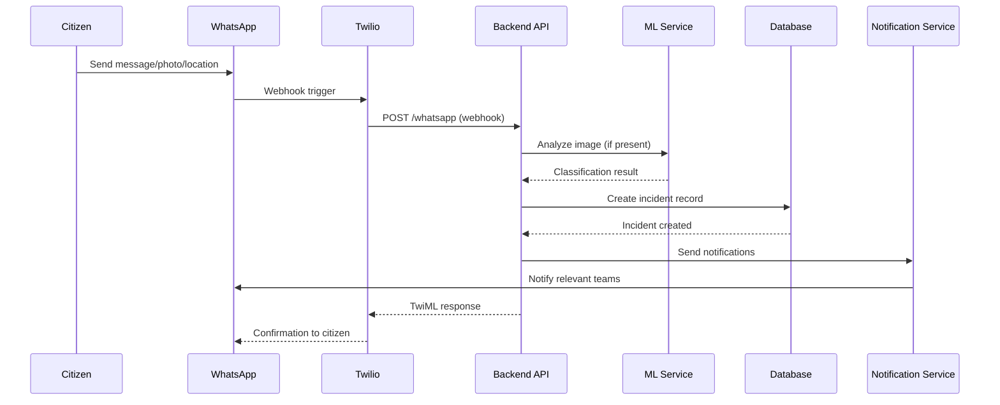
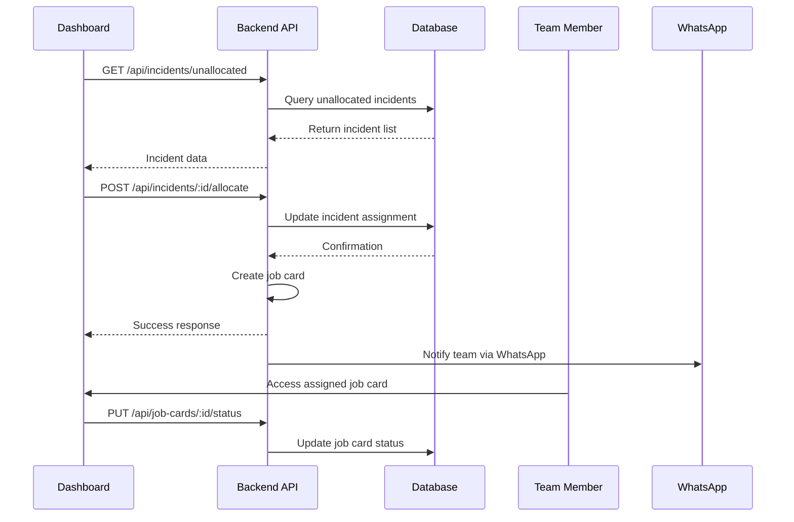
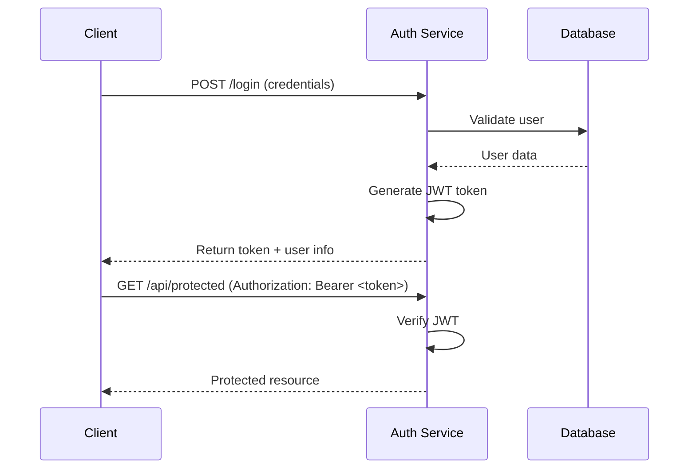
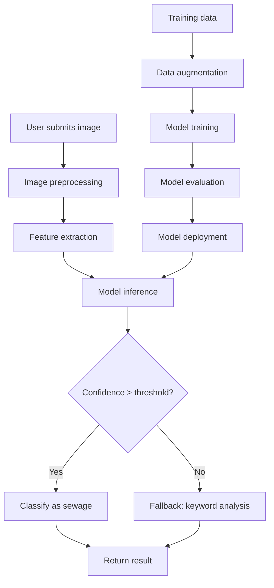
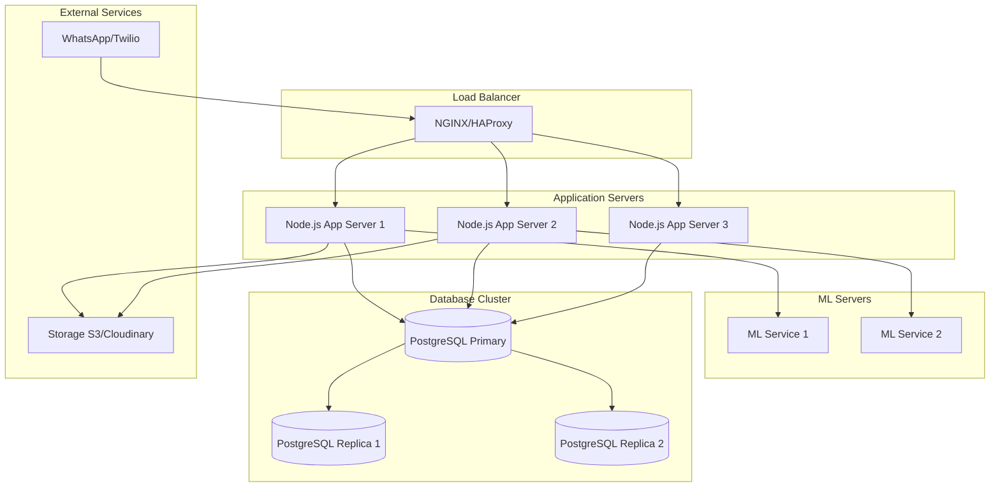
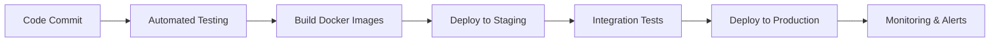

# Iqembu Lamanzi - System Architecture

## Overview

Iqembu Lamanzi is a comprehensive sewage incident management system that combines machine learning, real-time communication, and geospatial data management. The system enables citizens to report sewage issues via WhatsApp, automatically analyzes images using AI, and provides maintenance teams with efficient incident tracking and resolution tools.

## System Components

### 1. Backend Services (Node.js/Express)

**Location:** `/backend/`

**Base URLs:**
- Tailscale: `http://100.88.173.46:2000`
- Local: `http://localhost:2000`
- Production: `http://10.5.34.224:2000`

**Responsibilities:**
- RESTful API for incident and job card management
- WhatsApp and SMS integration via Twilio
- User authentication and authorization with JWT
- Real-time WebSocket notifications
- Geospatial data processing with PostGIS
- Fraud prevention and detection
- Advanced team management and analytics
- Progress tracking and reporting

**Key Technologies:**
- Node.js + Express.js
- PostgreSQL with PostGIS for geospatial data
- JWT for authentication with refresh tokens
- Twilio for WhatsApp and SMS integration
- Socket.io for real-time updates
- Comprehensive fraud prevention system

### 2. Machine Learning Service (Python)

**Location:** `/backend/ml/`

**Responsibilities:**
- Image classification for sewage-related content
- Real-time analysis of user-submitted photos
- Model training and evaluation
- Fallback keyword-based analysis

**Key Technologies:**
- PyTorch/TensorFlow
- OpenCV for image processing
- NumPy, Pandas for data manipulation
- Flask/FastAPI for model serving (planned)

### 3. Frontend Dashboard (React/Vue)

**Location:** `/frontend/`

**Responsibilities:**
- Incident monitoring and management
- Team assignment and tracking
- Heatmap visualization
- Real-time status updates
- Mobile-responsive design

**Key Technologies:**
- React.js or Vue.js
- Leaflet/Mapbox for maps
- Chart.js/D3.js for data visualization
- PWA capabilities for mobile access

### 4. Mobile Application (React Native/Capacitor)

**Location:** `/mobile/` (planned)

**Responsibilities:**
- Offline incident reporting
- GPS location services
- Camera integration for photo capture
- Push notifications
- Team coordination features

## Additional System Features

### Password Reset & Token Verification System

The system includes comprehensive password management capabilities:

- **Forgot Password:** Users can request password reset via email
- **Reset Password:** Secure password update with token validation
- **Verify Reset Token:** Token verification with expiration and single-use enforcement
- **Session/IP Tracking:** Monitoring of password reset attempts by IP and session

### Detailed Session Management

Advanced session security features:

- **Logout All:** Ability to terminate all active sessions for a user
- **Active Sessions List:** View all current active sessions with device information
- **Token Refresh:** Secure token renewal without re-authentication
- **Device/Session Tracking:** Detailed logging of login attempts, devices, and locations

### Public Citizen Registration API

Citizens can self-register through a dedicated API endpoint:

- **POST /api/users/submit:** Public registration endpoint for citizens
- No authentication required for initial registration
- Automatic role assignment as "Citizen"
- Email verification workflow

### Extensive Team Management API

Comprehensive team management with 20+ endpoints:

- **Team Creation:** POST /api/teams - Create new maintenance teams
- **Specialization Filtering:** GET /api/teams?specialization=sewage - Filter teams by expertise
- **Performance Metrics:** GET /api/teams/:id/metrics - Team performance analytics
- **Workload Analysis:** GET /api/teams/workload - Current team workloads
- **Recommendations:** GET /api/teams/recommendations - AI-powered team assignment suggestions
- **Bulk Operations:** POST /api/teams/bulk/add-members - Add multiple members at once
- **Bulk Operations:** POST /api/teams/bulk/remove-members - Remove multiple members
- **Team Incident Assignment:** PUT /api/teams/:id/incidents/:incidentId - Direct assignment

### Fraud Prevention Module

Advanced fraud detection and prevention system:

- **Proximity Detection:** Identify suspiciously close incident reports
- **Image Verification:** AI-powered validation of submitted images
- **Fraudulent Phone Blocking:** Automatic blocking of suspicious phone numbers
- **Fraud Logs:** Comprehensive logging of suspicious activities
- **Fraud Statistics:** Analytics dashboard for fraud patterns
- **Admin Configurations:** Customizable fraud detection rules and thresholds

### Incident Debug Mode (Development Only)

Developer tools for incident debugging:

- **GET /api/incidents/debug/all:** Complete incident dump with all metadata
- Includes internal system data, processing logs, and debugging information
- Only available in development environment
- Not exposed in production or user documentation

### Batch Job Card Operations

Efficient bulk operations for job card management:

- **Batch Allocate:** POST /api/job-cards/batch/allocate - Assign multiple incidents to teams
- **Batch Progress Update:** PUT /api/job-cards/batch/progress - Update multiple job cards simultaneously

### Progress Tracking Analytics

Comprehensive progress monitoring and analytics:

- **Timeline:** GET /api/progress/timeline - Historical progress data
- **History:** GET /api/progress/history - Complete audit trail
- **Summary:** GET /api/progress/summary - High-level progress overview
- **Team Progress:** GET /api/progress/teams - Team-specific progress metrics
- **Analytics:** GET /api/progress/analytics - Advanced analytics and insights

### Citizen Public Transparency Stats

Public access to system statistics:

- **GET /api/citizen/public-stats:** Anonymous access to key metrics
- Incident resolution rates, response times, and system performance
- Public transparency and accountability features

### Real-time WebSocket Notifications

Implemented WebSocket support for real-time updates:

- Live incident status updates
- Real-time team notifications
- Instant progress tracking
- Live dashboard updates

### Image Upload Limits & File Rules

Strict file upload controls:

- **Maximum 5 images** per incident report
- **10MB size limit** per individual image
- **Accepted formats:** JPEG, PNG, WebP
- Automatic image optimization and compression

### Pagination & Rate Limiting

System-wide pagination and performance controls:

- **Pagination limits:** Maximum 100 items per page
- **Rate limiting:** 1000 requests per hour per IP
- Consistent pagination across all list endpoints

### Available Incidents for Team Assignment

Smart team assignment features:

- **GET /api/teams/:id/incidents/available:** List incidents suitable for specific team
- Considers team specialization, location, and current workload
- Optimized assignment recommendations

### Health Check Endpoints

System monitoring and health verification:

- **GET /api/health/users:** User service health check
- **GET /api/health/citizen:** Citizen service health check
- **GET /api/health/system:** General system health status
- Automated monitoring and alerting integration

### SMS Webhook Support

Multi-channel communication support:

- **POST /sms:** SMS webhook for incident reporting
- Alternative to WhatsApp for SMS-based submissions
- Full integration with existing fraud prevention and processing pipeline

## Architecture Diagram

```
┌─────────────────────────────────────────────────────────────────┐
│                    External Services                            │
│  ┌─────────────────┐  ┌─────────────────┐  ┌─────────────────┐  │
│  │   WhatsApp      │  │   SMS/Twilio    │  │ PostgreSQL      │  │
│  │   (Citizens)    │  │   (Notifications)│  │   + PostGIS     │  │
│  └─────────────────┘  └─────────────────┘  └─────────────────┘  │
└─────────────────────────────────────────────────────────────────┘
                                   │
                                   ▼
┌─────────────────────────────────────────────────────────────────┐
│                    Backend Services                              │
│  ┌─────────────────┐  ┌─────────────────┐  ┌─────────────────┐  │
│  │   Express API   │  │   Twilio Webhook│  │   Notification  │  │
│  │   (REST/GraphQL)│  │   Handler       │  │   Service       │  │
│  └─────────────────┘  └─────────────────┘  └─────────────────┘  │
│                                                                 │
│  ┌─────────────────┐  ┌─────────────────┐  ┌─────────────────┐  │
│  │   Auth Service  │  │   Incident      │  │   Job Card      │  │
│  │   (JWT/OAuth)   │  │   Management    │  │   Management    │  │
│  └─────────────────┘  └─────────────────┘  └─────────────────┘  │
└─────────────────────────────────────────────────────────────────┘
                                   │
                                   ▼
┌─────────────────────────────────────────────────────────────────┐
│                    ML Services                                   │
│  ┌─────────────────┐  ┌─────────────────┐  ┌─────────────────┐  │
│  │   Image Analysis│  │   Model Training│  │   Data Pipeline │  │
│  │   Service       │  │   Pipeline      │  │   (ETL)         │  │
│  └─────────────────┘  └─────────────────┘  └─────────────────┘  │
└─────────────────────────────────────────────────────────────────┘
                                   │
                                   ▼
┌─────────────────────────────────────────────────────────────────┐
│                    Client Applications                           │
│  ┌─────────────────┐  ┌─────────────────┐  ┌─────────────────┐  │
│  │   Web Dashboard │  │   Mobile App    │  │   Admin Portal  │  │
│  │   (React/Vue)   │  │   (React Native)│  │   (Internal)    │  │
│  └─────────────────┘  └─────────────────┘  └─────────────────┘  │
└─────────────────────────────────────────────────────────────────┘
```

## Data Flow Architecture

### Incident Reporting Flow



### Incident Management Flow



## Database Schema

### Core Entities (PostgreSQL with PostGIS)

```mermaid
erDiagram
     INCIDENT ||--o{ JOB_CARD : generates
     INCIDENT {
         integer id PK
         string incidentNumber UK
         string reporterPhone
         text description
         string category
         string priority
         geography location
         string status
         jsonb mediaUrls
         timestamp createdAt
         timestamp updatedAt
         integer reporterId FK
     }

     JOB_CARD ||--|| TEAM : assigned_to
     JOB_CARD {
         integer id PK
         integer incidentId FK
         integer teamId FK
         integer assignedBy FK
         string status
         string priority
         text description
         geography location
         timestamp estimatedCompletion
         timestamp actualCompletion
         jsonb notes
         integer progress
         timestamp createdAt
         timestamp updatedAt
     }

     USER ||--o{ INCIDENT : reports
     USER ||--o{ JOB_CARD : assigns
     USER {
         integer id PK
         string userId UK
         string firstName
         string lastName
         string email UK
         string phone
         string role
         string passwordHash
         geography location
         timestamp createdAt
         timestamp lastLogin
         boolean isActive
     }

     TEAM ||--|{ TEAM_MEMBER : consists_of
     TEAM {
         integer id PK
         string name
         text description
         geography baseLocation
         string specialization
         string status
         integer leaderId FK
         timestamp createdAt
     }

     TEAM_MEMBER {
         integer id PK
         integer teamId FK
         integer userId FK
         string role
         timestamp joinedAt
     }
```



## API Architecture

### RESTful Design Principles

- **Resource-Based URLs:** `/api/incidents`, `/api/job-cards`, `/api/users`
- **HTTP Methods:** GET, POST, PUT, DELETE
- **Status Codes:** Standard HTTP status codes (200, 201, 400, 401, 404, 500)
- **Content Type:** JSON for all requests/responses
- **Authentication:** JWT Bearer tokens
- **Versioning:** URL-based versioning (`/api/v1/...`)

### Authentication Flow



## Machine Learning Pipeline

### Image Analysis Architecture



### Model Architecture

- **Input:** 224x224 RGB images
- **Preprocessing:** Normalization, resizing
- **Feature Extraction:** Convolutional layers
- **Classification:** Dense layers with softmax
- **Output:** Binary classification (sewage/not-sewage)
- **Training:** Transfer learning from ImageNet-pretrained models

## Deployment Architecture

### Production Environment



### Containerization Strategy

- **Backend:** Docker containers with Node.js
- **ML Service:** GPU-enabled containers for model inference
- **Database:** PostgreSQL with PostGIS extensions and persistent volumes
- **Orchestration:** Docker Compose for development, Kubernetes for production

## Security Architecture

### Authentication & Authorization
- JWT tokens with expiration
- Role-based access control (Guardian, Manager, Admin)
- Password hashing with bcrypt
- API rate limiting

### Data Protection
- HTTPS/TLS encryption
- Input validation and sanitization
- SQL injection prevention (PostgreSQL)
- XSS protection
- Rate limiting and DDoS protection

### WhatsApp Security
- Twilio webhook signature validation
- Request rate limiting
- Content moderation for user inputs

## Scalability Considerations

### Horizontal Scaling
- Stateless application servers
- Database read replicas
- Load balancing across multiple instances
- CDN for static assets

### Performance Optimization
- Database indexing on frequently queried fields
- Caching layer (Redis planned)
- Image optimization and compression
- Lazy loading for large datasets

### Monitoring & Logging
- Application performance monitoring
- Error tracking and alerting
- Database query performance
- ML model accuracy monitoring

## Future Enhancements

### Planned Features
- Advanced ML models (object detection, segmentation)
- Predictive analytics for incident hotspots
- Integration with municipal GIS systems
- Mobile offline capabilities

### Technology Upgrades
- GraphQL API for flexible queries
- Microservices architecture
- Serverless functions for ML inference
- Advanced caching and CDN integration

## Development Workflow

### CI/CD Pipeline


### Environment Strategy
- **Development:** Local Docker Compose setup
- **Staging:** Cloud environment for testing
- **Production:** Highly available cloud infrastructure
- **Disaster Recovery:** Multi-region deployment with automated failover

This architecture provides a robust, scalable foundation for the Iqembu Lamanzi sewage incident management system, enabling efficient coordination between citizens, maintenance teams, and municipal authorities.